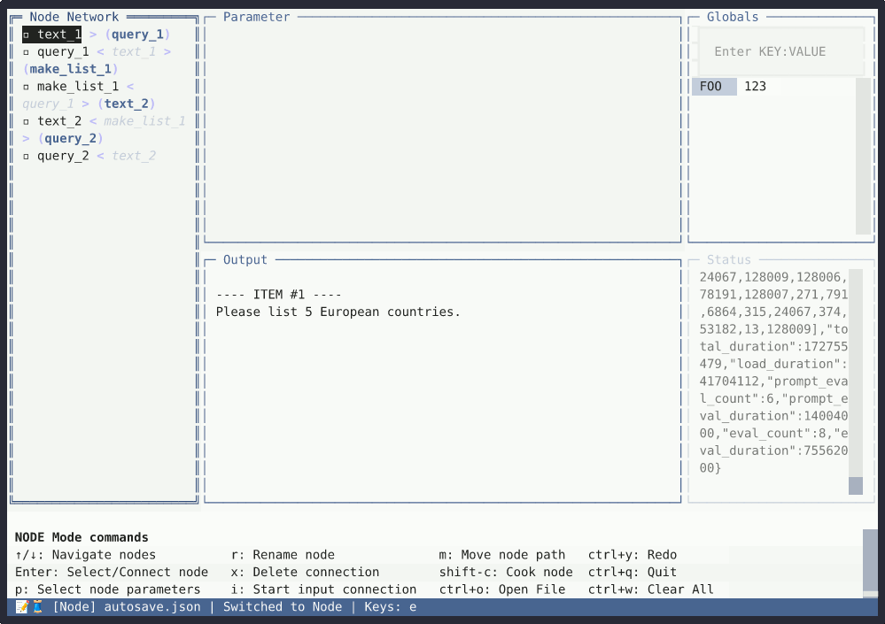

<!-- 

  

 -->

# ***Text Loom:*** :thread: :pencil:
# **Procedurally create your text!**

## :speech_balloon: What? 
Text Loom is a fun workspace for creating networks that manage queries and build on them.  
All from the comfort of your terminal!

# :page_with_curl: How?

*Text flows from one node to the next.*  
The Text Loom philosophy, it's backend, is all about **text**.  
*Specifically* **lists of text.**  

## Nodes pass text to each other:  
* One node creates text **(Text)**
* Some nodes read and write text files. **(FileIn & FileOut)**
* Some nodes create lists **(Section, Split, & MakeList)**
* One node combines lists **(Merge)**
* One node talks to an LLM **(Query)**
* One node can contain other nodes and iterate over them in loops **(Looper)**
* And one node does nothing at all except pass the text along **(Null)**

## :rocket: Start (automagically)

<code>curl -fsSL https://raw.githubusercontent.com/kleer001/Text_Loom/master/install.sh | bash ; cd Text_Loom </code>
 

## :sparkles: Start (manual) 
* Make sure you have **git** installed and **python3** (version 3.8 or higher)
* **Clone** the repository  
<code>git clone https://github.com/kleer001/Text_Loom ; cd Text_Loom</code>
* **Create** a local venv  
<code>python3 -m venv .venv</code>
* **Activate** it and set PYTHONPATH  
<code>source .venv/bin/activate ; export PYTHONPATH=\$PYTHONPATH:$(pwd)/src</code>
* **Install** in development mode  
<code>pip install -e .</code>
* **Run** the program  
<code>python3 src/TUI/tui_skeleton.py</code>

Note for Windows users:  
<code>Replace  **source .venv/bin/activate** with **.venv\Scripts\activate**  
and **export PYTHONPATH=\$PYTHONPATH:$(pwd)/src** with **set PYTHONPATH=%PYTHONPATH%;%cd%\src**</code>

## :package: Currently supported LLMS platforms 
*in  src/core/settings.cfg*  

| LLM Platform | URL                                    | Endpoint                                     |
|--------------|----------------------------------------|----------------------------------------------|
| Ollama       | localhost:11434                        | /api/generate                                |
| LM Studio    | localhost:1234                         | /v1/chat/completions                         |
| GPT4All      | localhost:4891                         | /v1/completions                              |
| LocalAI      | localhost:8080                         | /v1/chat/completions                         |
| llama.cpp    | localhost:8080                         | /completion                                  |
| oobabooga    | localhost:5000                         | /v1/chat/completions                         |
| ChatGPT      | https://api.openai.com                 | /v1/chat/completions                         |
| Perplexity   | https://api.perplexity.ai             | /v1/chat/completions                         |
| Claude       | https://api.anthropic.com              | /v1/messages                                 |
| Gemini       | https://generativelanguage.googleapis.com | /v1/models/gemini-1.5-pro:generateContent   |

* Please suggest more free local LLMs if you like. And feel free to change your local settings.cfg to fit your own purposes. The structure should be self-evident from the examples in it.  

## :walking: GUI WALK THROUGH 
### :eyes: MAIN WINDOW 

