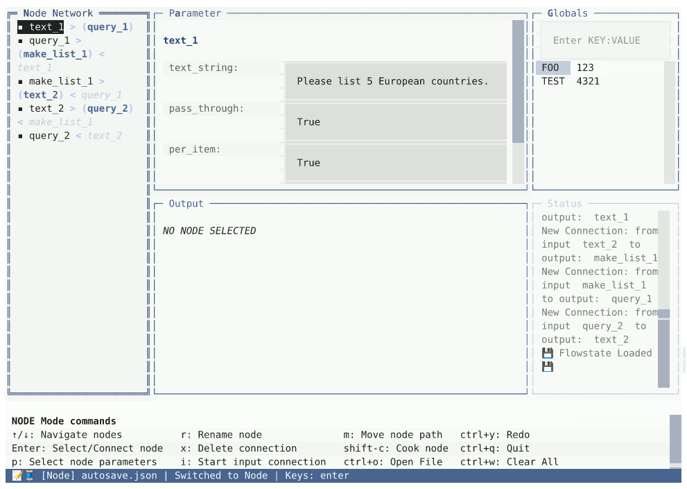

# Text Loom

**Visual programming for LLM workflows. Node-based text processing in your terminal.**

Build complex text workflows by connecting nodes—no code required. Query LLMs, transform text, iterate over lists, and save results.



---

## Quick Start

```bash
git clone https://github.com/kleer001/Text_Loom
cd Text_Loom
python3 -m venv .venv
source .venv/bin/activate
pip install -e .
export PYTHONPATH=$PYTHONPATH:$(pwd)/src

./text_loom.py              # Start GUI (default)
./text_loom.py -t           # Terminal UI
./text_loom.py -r           # Python REPL
./text_loom.py -b -f work.json  # Batch execute
```

**One-liner:**
```bash
curl -fsSL https://raw.githubusercontent.com/kleer001/Text_Loom/master/install.sh | bash && cd Text_Loom
```

**Docker:**
```bash
git clone https://github.com/kleer001/Text_Loom
cd Text_Loom
python3 docker_wizard.py
```

---

## Interfaces

Choose your workflow—all use the same core:

```bash
./text_loom.py -r           # REPL: Interactive Python shell (hython-style)
./text_loom.py -t           # TUI: Terminal UI (keyboard-driven)
./text_loom.py -a           # API: FastAPI server (automation)
./text_loom.py -g           # GUI: Web interface (visual)
./text_loom.py -b           # Batch: Non-interactive execution
```

---

## What Makes Text Loom Different

| Feature | Text Loom | n8n | LangChain | ComfyUI | Zapier | Node-RED |
|---------|-----------|-----|-----------|---------|--------|----------|
| **Open Source** | ✅ | ✅ | ✅ | ✅ | ❌ | ✅ |
| **Runs Offline** | ✅ | ✅ | ✅ | ✅ | ❌ | ✅ |
| **Terminal UI** | ✅ | ❌ | ❌ | ❌ | ❌ | ❌ |
| **Web UI** | ✅ | ✅ | ❌ | ✅ | ✅ | ✅ |
| **Code Interface** | ✅ | ❌ | ✅ | ❌ | ❌ | ❌ |
| **Visual Programming** | ✅ | ✅ | ❌ | ✅ | ✅ | ✅ |
| **Text-First Data** | ✅ | ❌ | ❌ | ❌ | ❌ | ❌ |
| **LLM-Focused** | ✅ | ❌ | ✅ | ❌ | ❌ | ❌ |
| **No Programming Required** | ✅ | ✅ | ❌ | ✅ | ✅ | ✅ |
| **Lightweight (<50MB)** | ✅ | ❌ | ✅ | ❌ | N/A | ✅ |
| **Batch Processing** | ✅ | ✅ | ✅ | ✅ | ✅ | ✅ |
| **Self-Hosted** | ✅ | ✅ | ✅ | ✅ | ❌ | ✅ |

**Text Loom treats text as the primary data type.** Everything is a list of strings flowing through nodes. No JSON wrappers, no object hierarchies—just text in, text out.

---

## What You Can Do

**Visual workflows** - Connect nodes, not code

**LLM integration** - Ollama, OpenAI, Claude, Gemini, local models

**Batch processing** - Loop over lists, transform files in bulk

**Multiple interfaces** - TUI, GUI, REPL, API, batch—choose your style

**Scriptable** - Full Python API access for automation

---

## Core Nodes

Create text → Read files → Query LLMs → Split/merge lists → Loop operations → Save results

[Full documentation →](https://github.com/kleer001/Text_Loom/wiki)

---

## Why?

Visual programming exists for 3D, images, games, music, and audio. Text deserves the same treatment.

Text Loom makes procedural prompt engineering and text manipulation visual and intuitive—with text as the foundation, not an afterthought.

---

## Contributing

Issues and PRs welcome. MIT License.
